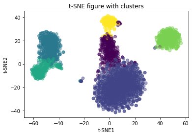

## Cell Clustering based on Gene Expression Profiles

The hypothesis was that we can detect different types of peripheral blood mononuclear cells using single-cell RNA-Seq. We started with data supplying normalized expression values of the most variable genes in a population of peripheral blood mononuclear cells. The following steps were then performed:

- transformation of the normalized expression values
- usage of PCA and t-SNE to reduce the dimensionality and visualize the data
- cell clustering based on gene profiles, the result of which is shown below

