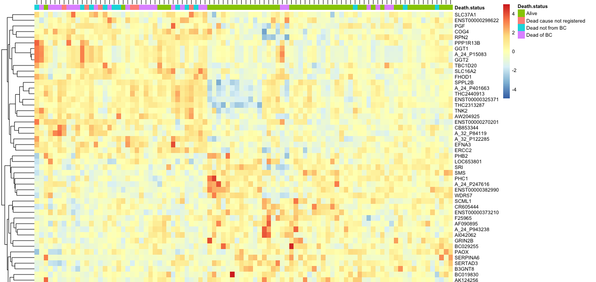

## Statistical Analysis of mRNA Data using R

Using high throughput sequencing or microarray technologies, it is possible to identify RNA levels of every gene across a large number of cancer patients. R is useful for analysing and visualizing these changes across a patient cohort.

In any disease tissue, some genes are up-regulated relative to a normal tissue and some are down-regulated. Assuming that the genes that play a more prominent role in cancer show more variance than others, we calculated the standard deviation for each gene from the mRNA data.

Once we had a sense of what genes are changing the most, the next step was to determine if those changes are relevant to the disease. A good way to do that was to use heatmaps. Biologically, this becomes more interesting when we cluster the genes across the patients. Genes that cluster together have been found to be part of similar biological processes such as cell division and cell death. Patients that cluster together often have similar disease characteristics.

Even more interesting would be to identify a specific set of genes that were specifically involved in a causing a particular cancer subtype. We thus used the correlation statistic to identify genes in the data that best correlate with a patient's likelihood of survival. Then we used the heatmap to plot these genes to see if the clustering kept all the patients who survive together. 

In the resulting heatmap, the cluster of patients that were alive clustered together (with a few exceptions). This implied that the genes selected may play a role in helping the patient respond to treatment, or simply suggest a milder form of cancer. 

